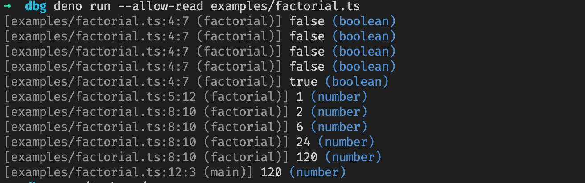

# dbg

A `dbg(…)` function for Deno. Heavily inspired by Rusts'
[`dbg!(…)` macro](https://doc.rust-lang.org/std/macro.dbg.html).

## Examples

```ts
import { dbg } from "https://deno.land/x/dbg/mod.ts";

const a = 2;
const b = dbg(a * 2) + 1;
//        ^-- [examples/main.ts:4:11] 4 (number)
console.assert(b === 5);
```

factorial implementation([examples/factorial.ts](examples/factorial.ts)):

```ts
import { dbg } from "https://deno.land/x/dbg/mod.ts";

function factorial(n: number): number {
  if (dbg(n <= 1)) {
    return dbg(n);
  }

  return dbg(n * factorial(n - 1));
}

function main() {
  dbg(factorial(5));
}

if (import.meta.main) {
  main();
}
```

This prints:



## Advanced Features

Not just `console.debug`, but more:

- colorful output(can disable by `NO_COLOR` ENVIRONMENT)
- print file name, function name, line and column
- auto detect `--allow-read` permission(see [Read Permission](#read-permission))

## Read Permission

Run with `--allow-read` flag:

```bash
$ deno run --allow-read ./examples/main.ts
[examples/main.ts:4:11] 4 (number)
```

Run without `--allow-read` flag:

```bash
$ deno run ./examples/main.ts
No read access to <CWD>, use full path. Or run again with --allow-read. See https://github.com/justjavac/deno_dbg#read-permission
[/Users/justjavac/tmp/dbg/examples/main.ts:4:11] 4 (number)
```

## License

[deno_dbg](https://github.com/justjavac/deno_dbg) is released under the MIT License. See the bundled
[LICENSE](./LICENSE) file for details.
